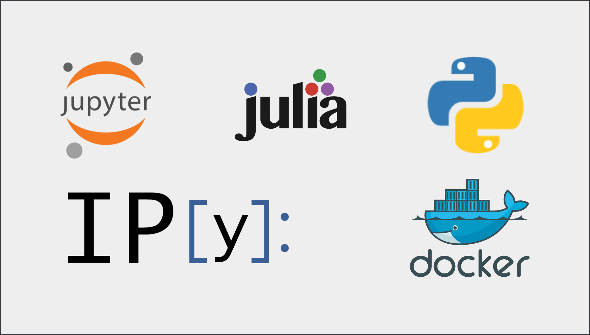
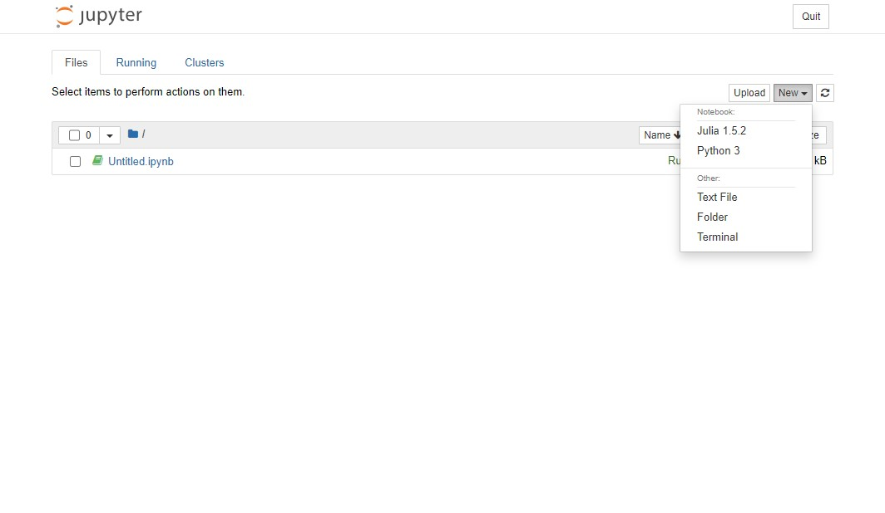

# Julia, PyJulia, IPython, IJulia and Jupyter Notebooks in Docker

[](https://travis-ci.com/kashif-se/docker-ipyjulia-notebooks)


This repository is the dockerized environment contains following set of tools:
1. Python (3.7)
2. Julia (1.5.2)
3. IPython
4. PyJulia
5. IPyJuila
6. PyCall
7. Jupyter Notebooks
6. Numpy and Pandas

Pyhton and Julia kernals are installed for Jupyter Notebooks.




### Usage:

```sh
$ docker pull kshfse/ipyjulia-notebooks
$ docker run -v ./notebooks:/home/julia/notebooks -p 8888:8888 -d kshfse/ipyjulia-notebooks         # starts jupyter notebooks
```
### Running via docker-compose:

```sh
$ docker-compose up -d
```
### Accessing notebooks via browser
Open browser and navigate to `http://<machine-ip>:8888` in case docker is running in local machine, you can navigate to: `http://localhost:8888`

By default the notebook password is disabled which is not recommended. You can remove the following parameters from [`Dockerfile`](Dockerfile) to setup password:
1. --NotebookApp.password=''
2. --NotebookApp.token=''

### Adding Julia Libraries:
Open [`install.jl`](install.jl) and add REPL of your required libraries. 

### Adding Julia Libraries:
Open [`requirements.txt`](requirements.txt) and add names of your required libraries. 

To make it work, you need to build your image again.
```sh
$ docker image build -t kshfse/ipyjulia-notebooks .
$ docker run -v ./notebooks:/home/julia/notebooks -p 8888:8888 -d kshfse/ipyjulia-notebooks         # starts jupyter notebooks
```

